

<h1>1pp (One Pixel Productions) - WIP</h1>

<h3>A Spellhold Studios mod for Infinity Engine games<h3>

 

**Author:** Erephine   
<strong>Version:</strong> 4.2.0  
**Languages:** English, <a href="README_FR.md">French</a>  

**Mod Website:** <a href="http://www.spellholdstudios.net/ie/1pp">Spellhold Studios</a>   
**Mod forum:** <a href="http://www.shsforums.net/forum/159-1pp/">One Pixel Productions</a>  

Readme writing in progress... Don't try to download and install this mod as it is a WIP version and its install will fail, because of missing files still in development or in beta testing

[Read the mod's readme](https://spellholdstudios.github.io/readmes/1pp-readme-english.html)

[Download the mod at Spellhold Studios](http://www.shsforums.net/files/file/1006-1ppv410/) 

&nbsp;

<a href="#intro">Overview</a> &#x2B25; <a href="#installation">Installation</a> &#x2B25; <a href="#components">Components</a> &#x2B25; <a href="#101">Mod Details</a> &#x2B25; <a href="#credits">Credits</a> &#x2B25; <a href="#version">Version History</a> 

## Overview

Without a doubt the most comprehensive mod when it comes to post-release QA and visuals, 1pp has been a growing work of love for close to 8 years with the aim of providing a refined, polished experience with attention to detail that many felt was lacking in some aspects of Baldur's Gate II compared to its predecessor.  
1ppv4 represents the culmination of this effort, bringing together the various previously disjointed graphical and mechanical tweaks and components that have accumulated over the years and many more besides; updated, streamlined and in the form of one coherent installer. 

This mod offers the player the option to change the paperdolls and inventory icons of Baldur's Gate II to those of Baldur's Gate, and adds a number of completely new fixes, additions and alterations to the original BGII game. Technically speaking, One Pixel Productions is an attempt to fix "*cosmetic flaws*" that should have never made it through QA, as well as improve upon a number of other of things. It contains many <a href="#components">components</a>, including: BG1 Paperdoll and inventory item ports, except for potions, BG1-style Flaming Swords, Flaming Short Swords (with item and mod item patches), new Paperdolls (human, half-orc, elven, halfling, dwarf), legacy Shields, Colourable Quarterstaves (with item patches)...

Visit the <a href="http://www.spellholdstudios.net/ie/1pp">website</a> or <a href="http://www.shsforums.net/forum/159-1pp/">forum</a> for all the latest updates. 

<a href="#top">Back to top</a>

## Compatibility

This mod is designed to work on the following classical Infinity Engine games:

- The original Baldur's Gate II (BG2, or just SoA), with or without the Throne of Bhaal (ToB) expansion.
- The conversion projects Baldur's Gate Trilogy (BGT) and Baldur's Gate Tutu (Tutu).
- The original Icewind Dale (IWD) with either of its expansions, Heart of Winter (HoW) and Trials of the Luremaster (TotLM).
- Icewind Dale II (IWD2).

1pp is a WeiDU mod, and therefore should be compatible with all WeiDU mods. However, we cannot test every single one. If you encounter any bugs, please report them on the forum!

BG2 and TOB players are also strongly recommended to download and install the <a href="http://www.gibberlings3.net/bg2fixpack/">BG2 Fixpack</a> before proceeding with the installation of this mod. 

<a href="#top">Back to top</a>

## Installation

#### Notes

<em>If you've previously installed the mod, remove it before extracting the new version. To do this, run <strong>setup-1pp.exe</strong>, uninstall all previously installed components and delete the 1pp folder.</em>

<em>When installing or uninstalling, <strong>do not close the <acronym title="Disk Operating System">DOS</acronym> window</strong> by clicking on the <strong>X</strong> button! Instead, press the <strong>Enter</strong> key whenever instructed to do so.</em>

<em><strong>Disable any antivirus</strong> or other memory-resident software before installing this or any other mod. Some (particularly avast and Norton!) have a tendency to report false positives with mod activity, resulting in failed installs.</em>

## 

#### Windows

1pp for Windows is distributed as an extractable compressed archive and includes a WeiDU installer.

Extract the contents of the mod archive into the folder of the game you wish to modify, using <a href="http://www.7-zip.org/download.html">7zip</a>, <a href="http://www.rarlab.com/download.htm">WinRAR</a>, or another file compression utility that handles .zip files. When properly extracted, your game directory will contain <strong>setup-1pp.exe</strong> and the folder <strong>1pp</strong>. To install, double-click <strong>setup-1pp.exe</strong> and follow the instructions on screen.

You can run <strong>setup-1pp.exe</strong> in your game folder to reinstall, uninstall or otherwise change components.

## 

#### Note for Complete Uninstallation

In addition to the methods above for removing individual components, you can completely uninstall the mod using <strong>setup-1pp --uninstall</strong> at the command line to remove all components without wading through prompts.

## 

#### <a name="config" id="config">:warning: Warning: new installation process

##### As of version 4.2.0, variables needed for installation are read from <a href="1pp/1pp-config-default.ini">1pp-config-default.ini</a> file, or 1pp-config.ini if it exists.

The previous version interrupted installation with plain text prompts allowing players to customise components to their liking (depending on which IE game the mod is installed for and already installed components). All those variables set during installation have been moved into <a href="1pp/1pp-config-default.ini">**_1pp-config-default.ini_**</a> file, found in 1pp folder. This file provides a '_standard_' installation.

If players want to define their own customized installation, they have to edit the file 1pp-config-default.ini in Notepad or another text editor, then save it as **_1pp-config.ini_**. Each line consists of a configuration option, then '=', then a number (or in one case a string). The only thing you should edit is the number (or string).

The installation process will read both ini files and prioritize user's option values. If a value is not set or mismatched in 1pp-config.ini, any installation failure will be prevented by reverting it back to its default value.

Please read the <a href="1pp/1pp-config-english.txt">1pp-config-language.txt</a> file (with 'language' being the installation language you chose) to check the variables names and their meanings. Here is a chart listing the options related to the installation process:  

<table summary="Installation variables list">
	<tr style="font-size: 125%; line-height: 160%;">
		<th style="border: 1px solid #781808; text-align: center; background-color: #781808; color: #e5e5e5; ">Component Variable</th>
		<th style="border: 1px solid #781808; text-align: center; background-color: #781808; color: #e5e5e5; ">Games supported Description</th>
	</tr>
	<tr>
		<td style="border: 1px solid #781808; text-align: center; padding-top:20px; padding-bottom:20px; "><strong>101 female dwarf paperdolls style</strong></td>
		<td style="border: 1px solid #781808; padding-left:5px; padding-right:5px; padding-top:20px; padding-bottom:20px; ">
(only available for Heart of Winter or Trials of the Luremaster if Infinity Animations is installed)
</td>
	</tr>
	<tr>
		<td style="border: 1px solid #781808; text-align: center; ">1pp_fdwarf</td>
		<td style="border: 1px solid #781808; padding-left:5px; padding-right:5px">FEMALE DWARF PAPERDOLLS STYLE  
		Use 1pp or IWD style female dwarf paperdolls?  
		1 = IWD 
		2 = 1pp [default]</td>
	</tr>
	<tr>
		<td style="border: 1px solid #781808; text-align: center; padding-top:20px; padding-bottom:20px; "><strong>104 GUI additions for BGII</strong></td>
		<td style="border: 1px solid #781808; text-align: center; padding-top:20px; padding-bottom:20px; padding-left:5px; padding-right:5px; ">(BG2, ToB, tutu, tutu_totsc and ca)</td>
	</tr>
	<tr>
		<td style="border: 1px solid #781808; text-align: center; ">1pp_gui_soa</td>
		<td style="border: 1px solid #781808; padding-left:5px; padding-right:5px">SoA STYLE LOADING SCREENS FOR ToB  
		Do you want to include SoA style loading screens for ToB?  
		1 = Yes [default] 
		2 = Keep loading screens unchanged</td>
	</tr>
	<tr>
		<td style="border: 1px solid #781808; text-align: center; ">1pp_updated_fonts</td>
		<td style="border: 1px solid #781808; padding-left:5px; padding-right:5px">UPDATED FONTS  
		Install updated fonts? (may cause issues with languages using different font .BAMs)  
		1 = Yes 
		2 = Keep fonts unchanged [default]</td>
	</tr>
	<tr>
		<td style="border: 1px solid #781808; text-align: center; ">1pp_mixed_labels  
		(Only available with Updated fonts installed)</td>
		<td style="border: 1px solid #781808; padding-left:5px; padding-right:5px">MIXED CASE LABELS  
		Use mixed case labels?  
		1 = Yes [default] 
		2 = No</td>
	</tr>
	<tr>
		<td style="border: 1px solid #781808; text-align: center; padding-top:20px; padding-bottom:20px; "><strong>114 Softer Spell Effects</strong></td>
		<td style="border: 1px solid #781808; padding-left:5px; padding-right:5px; padding-top:20px; padding-bottom:20px; ">
(BG2, ToB, tutu, tutu_totsc and ca)
</td>
	</tr>
	<tr>
		<td style="border: 1px solid #781808; text-align: center; ">1pp_agannazar_scorcher</td>
		<td style="border: 1px solid #781808; padding-left:5px; padding-right:5px">IWD-STYLE AGANNAZAR's SCORCHER  
		Install IWD-style Agannazar's Scorcher or alternate style?  
		1 = IWD style 
		2 = BGII alternate [defaut]</td>
	</tr>
	<tr>
		<td style="border: 1px solid #781808; text-align: center; ">1pp_dispel_magic_effect</td>
		<td style="border: 1px solid #781808; padding-left:5px; padding-right:5px">LESS OBTRUSIVE DISPEL MAGIC EFFECT  
		Install less obtrusive dispel magic effect?  
		1 = Yes [default] 
		2 = No (install improved stock effect instead)</td>
	</tr>
	<tr>
		<td style="border: 1px solid #781808; text-align: center; padding-top:20px; padding-bottom:20px; "><strong>200 Core content patches</strong></td>
		<td style="border: 1px solid #781808; padding-left:5px; padding-right:5px; padding-top:20px; padding-bottom:20px; ">
(BG2, ToB, tutu, tutu_totsc and ca)
</td>
	</tr>
	<tr>
		<td style="border: 1px solid #781808; text-align: center; ">1pp_hammers_icons</td>
		<td style="border: 1px solid #781808; padding-left:5px; padding-right:5px">RUNEHAMMER INVENTORY ICONS  
		This component overwrites the vanilla Runnehammer icon and sets it to Borok's Fist +2, then assigns Borok's Fist's icon to Runehammer. Do you want to apply those changes?  
		1 = Yes [default] 
		2 = No, assign the new icon to Borok's Fist, but keep Runnehammer icon for their respective hammers.</td>
	</tr>
	<tr>
		<td style="border: 1px solid #781808; text-align: center; ">1pp_potions_icons</td>
		<td style="border: 1px solid #781808; padding-left:5px; padding-right:5px">UPDATED POTIONS ICONS  
		Do you want to include updated potion graphics?  
		1 = Yes 
		2 = No, everything but Potions! [default]</td>
	</tr>
	<tr>
		<td style="border: 1px solid #781808; text-align: center; padding-top:20px; padding-bottom:20px; "><strong>202 Spell tweaks</strong></td>
		<td style="border: 1px solid #781808; padding-left:5px; padding-right:5px; padding-top:20px; padding-bottom:20px; ">
(BG2, ToB, tutu, tutu_totsc and ca)
</td>
	</tr>
	<tr>
		<td style="border: 1px solid #781808; text-align: center; ">1pp_iwd_cause_wounds_icons</td>
		<td style="border: 1px solid #781808; padding-left:5px; padding-right:5px">IWD-STYLE ICONS FOR 'CAUSE WOUND' SPELLS  
		Do you want existing 'cause wound' spells to use IWD-style icons? (healing icon in red)  
		1 = Yes [default] 
		2 = No, keep BG2 icons for existing spells.</td>
	</tr>
	<tr>
		<td style="border: 1px solid #781808; text-align: center; ">1pp_cure_spells_conflict</td>
		<td style="border: 1px solid #781808; padding-left:5px; padding-right:5px">OVERWRITE CAUSE LIGHT WOUNDS AND CAUSE MEDIUM WOUNDS SPELLS  
		If SPPR142/1342 (Cause Light Wounds, Cause Medium Wounds) are already taken by a previously installed mod, proceeding to install may cause issues.  
		1 = Yes, install [par défaut] 
		2 = No, cancel installation</td>
	</tr>
	<tr>
		<td style="border: 1px solid #781808; text-align: center; padding-top:20px; padding-bottom:20px; "><strong>400 Core updates and item patches</strong></td>
		<td style="border: 1px solid #781808; padding-left:5px; padding-right:5px; padding-top:20px; padding-bottom:20px; ">
(BG2, ToB, tutu, tutu_totsc and ca). Requires component 200 Core content patches
</td>
	</tr>
	<tr>
		<td style="border: 1px solid #781808; text-align: center; ">1pp_shields_appearance  
		Requires component 206 Additional Shield Animations (core)</td>
		<td style="border: 1px solid #781808; padding-left:5px; padding-right:5px">SHIELDS APPEARANCE  
		This sets the standard appearance of shields in the game in the sense that these will be the ones you mostly find in stores, etc. Does not necessarily affect magical items or prevent you from finding other items.  
		1 = 1ppv4-Baldur's Gate II style [default] 
		2 = Baldur's Gate I style 
		3 = Faux Baldur's Gate I style (use BG1 icons but not animations) 
		4 = Skip this part of the install</td>
	</tr>
	<tr>
		<td style="border: 1px solid #781808; text-align: center; ">1pp_shields_scatter  
		Requires component 206 Additional Shield Animations (core)</td>
		<td style="border: 1px solid #781808; padding-left:5px; padding-right:5px">SCATTER SHIELDS THROUGHOUT GAME  
		This determines whether the available extra shields are scattered throughout the game world (in the form of new items, random finds, etc.) for you to find or not.  
		1 = Yes [default] 
		2 = No</td>
	</tr>
	<tr>
		<td style="border: 1px solid #781808; text-align: center; ">1pp_helmets_appearance  
		Requires component 208 Additional Helmet Animations (core)</td>
		<td style="border: 1px solid #781808; padding-left:5px; padding-right:5px">HELMETS APPEARANCE  
		This sets the standard appearance of helmets in the game in the sense that these will be the ones you mostly find in stores, etc. Does not necessarily affect magical items or prevent you from finding other items.  
		1 = 1ppv4 style [default] 
		2 = Faux Baldur's Gate I style (use BG1 icons but not animations) 
		3 = Baldur's Gate II style 
		4 = Skip this part of the install</td>
	</tr>
	<tr>
		<td style="border: 1px solid #781808; text-align: center; ">1pp_helmets_scatter  
		Requires component 208 Additional Helmet Animations (core)</td>
		<td style="border: 1px solid #781808; padding-left:5px; padding-right:5px">HELMETS THROUGHOUT GAME  
		This determines whether the available extra helmets are scattered throughout the game world (in the form of new items, random finds, etc.) for you to find or not.  
		1 = Yes [default] 
		2 = No</td>
	</tr>
	<tr>
		<td style="border: 1px solid #781808; text-align: center; ">1pp_helmets_compatibility  
		Requires component 208 Additional Helmet Animations (core)</td>
		<td style="border: 1px solid #781808; padding-left:5px; padding-right:5px">HELMETS COMPATIBILITY  
		This is mainly for unsupported third party mods and determines the animation these will use.  
		1 = updated Baldur's Gate II style [default] 
		2 = based on Baldur's Gate I style (automatically set when 1pp_helmets_appearance = 2) 
		3 = Skip this part of the install</td>
	</tr>
	<tr>
		<td style="border: 1px solid #781808; text-align: center; ">1pp_armours_appearance</td>
		<td style="border: 1px solid #781808; padding-left:5px; padding-right:5px">ARMOUR ITEM ICONS  
		This sets the standard appearance of armour inventory icons in the game. Does not necessarily affect magical items or prevent you from finding other items.  
		1 = 1ppv4 style [default] 
		2 = Baldur's Gate I style 
		3 = Baldur's Gate II style 
		4 = Skip this part of the install</td>
	</tr>
	<tr>
		<td style="border: 1px solid #781808; text-align: center; ">1pp_armours_scatter</td>
		<td style="border: 1px solid #781808; padding-left:5px; padding-right:5px">SCATTER ARMOURS THROUGHOUT GAME  
		This determines whether the available alternates are scattered throughout the game world (in the form of new items, random finds, etc.) for you to find or not.  
		1 = Yes [default] 
		2 = No</td>
	</tr>
	<tr>
		<td style="border: 1px solid #781808; text-align: center; ">1pp_forced_item_colours</td>
		<td style="border: 1px solid #781808; padding-left:5px; padding-right:5px">FORCED ITEM COLOURS  
		This determines which item colours are set/uneditable for equipped items. By default, magical items have set item colours while non magical shields/helmets do not (allowing you to customise them via your clothing colour).  
		1 = Yes for magical items/No for non-magical items [default] 
		2 = Yes for both magical and non-magical items 
		3 = Yes for both magical and non-magical items, but exclude BG1 legacy shields 
		4 = No for either magical nor non-magical items</td>
	</tr>
	<tr>
		<td style="border: 1px solid #781808; text-align: center; ">1pp_shields_shadows</td>
		<td style="border: 1px solid #781808; padding-left:5px; padding-right:5px">PAPERDOLL SHADOWS (SHIELDS)  
		Traditionally, equipped objects do not render shadows on paperdolls. Enable this option if you want shields to cast shadows on paperdolls  
		1 = No 
		2 = Yes [default]</td>
	</tr>
	<tr>
		<td style="border: 1px solid #781808; text-align: center; ">1pp_helmets_shadows</td>
		<td style="border: 1px solid #781808; padding-left:5px; padding-right:5px">PAPERDOLL SHADOWS (HELMETS)  
		Traditionally, equipped objects do not render shadows on paperdolls. Enable this option if you want helmets to cast shadows on paperdolls.  
		1 = No 
		2 = Yes [default]</td>
	</tr>
	<tr>
		<td style="border: 1px solid #781808; text-align: center; ">1pp_gemlore</td>
		<td style="border: 1px solid #781808; padding-left:5px; padding-right:5px">GEMS LORE  
		Do you want gems to require some lore to identify?  
		1 = Yes [default] 
		2 = No</td>
	</tr>
	<tr>
		<td style="border: 1px solid #781808; text-align: center; ">1pp_tutu_bg1_shields  
		(only available for tutu and tutu_totsc)</td>
		<td style="border: 1px solid #781808; padding-left:5px; padding-right:5px">APPLY SAME SHIELD SETTING TO Tutu/BG1 SHIELDS  
		Do you want your shield setting to apply to Tutu/BG1 shields as well (warning: replaces Tutu's default shields)?  
		1 = No [default] 
		2 = Yes</td>
	</tr>
	<tr>
		<td style="border: 1px solid #781808; text-align: center; ">1pp_tutu_bg1_helmets  
		(only available for tutu and tutu_totsc)</td>
		<td style="border: 1px solid #781808; padding-left:5px; padding-right:5px">APPLY SAME BG2 HELMET INVENTORY ICON SETTING TO Tutu/BG1 HELMETS  
		Do you want your BG2 helmet inventory icon choices to apply to Tutu/BG1 helmets as well (warning: replaces Tutu's default helmets)?  
		1 = No [default] 
		2 = Yes</td>
	</tr>
	<tr>
		<td style="border: 1px solid #781808; text-align: center; ">1pp_sleeper</td>
		<td style="border: 1px solid #781808; padding-left:5px; padding-right:5px">TURN THE SLEEPER INTO A FLAIL  
		Do you want to turn the morningstar +2 The Sleeper into a flail?  
		1 = Yes [par défaut] 
		2 = No, but install the alternate flail icon IBLUN16B as a new resource for modders.</td>
	</tr>
	<tr>
		<td style="border: 1px solid #781808; text-align: center; padding-top:20px; padding-bottom:20px; "><strong>400 Core updates and item patches</strong></td>
		<td style="border: 1px solid #781808; padding-left:5px; padding-right:5px; padding-top:20px; padding-bottom:20px; ">
(HoW and TotLM)
</td>
	</tr>
	<tr>
		<td style="border: 1px solid #781808; text-align: center; ">1pp_gemlore</td>
		<td style="border: 1px solid #781808; padding-left:5px; padding-right:5px">GEMS LORE  
		Do you want gems to require some lore to identify?  
		1 = Yes [default] 
		2 = No</td>
	</tr>
	<tr>
		<td style="border: 1px solid #781808; text-align: center; ">1pp_forced_item_colours_iwd</td>
		<td style="border: 1px solid #781808; padding-left:5px; padding-right:5px">ITEM COLOURS FOR NON-MAGICAL ITEMS IN IWD  
		This determines whether item colours are set for common, non magical shields/helmets. By default, these remain unset so the player can choose their own (matching their clothing colour). By enabling this option, item colours are set for all items.  
		1 = No [default] 
		2 = Yes</td>
	</tr>
	<tr>
		<td style="border: 1px solid #781808; text-align: center; padding-top:20px; padding-bottom:20px; "><strong>300 Fixed animations for solars and elementals</strong></td>
		<td style="border: 1px solid #781808; padding-left:5px; padding-right:5px; padding-top:20px; padding-bottom:20px; ">
(ToB, Tutu, tutu_totsc and ca)
</td>
	</tr>
	<tr>
		<td style="border: 1px solid #781808; text-align: center; ">1pp_solar_weapons</td>
		<td style="border: 1px solid #781808; padding-left:5px; padding-right:5px">FIXES ANIMATIONS FOR SOLARS AND ELEMENTALS  
		There are two choices for the appearance of weapons wielded by solars. Please pick your preference:  
		1 = New appearance (solid object with glow) [default] 
		2 = As in BGII vanilla (blurry bright glow all over)</td>
	</tr>
</table> 

<a href="#top">Back to top</a>

## Components

The installer includes the following components. The number of each is the component <em>DESIGNATED</em> number which gives it a fixed install position, lets other components detect it and allows automated installers like the BiG World Setup specify component choices.

&#8258; <strong>Game engine and core related content</strong> 
><a href="#101">[101] 1ppv4: Core paperdolls</a> 
><a href="#102">[102-103] 1ppv4: Extended palette entries</a> 
><a href="#104">[104] 1ppv4: GUI additions for BGII</a> 
><a href="#105">[105] 1ppv4: Avatar fixes</a> 
><a href="#106">[106-109] 1ppv4: Female Dwarves</a> 
><a href="#110">[110-112] 1ppv4: Thieves Galore</a> 
><a href="#113">[113] 1ppv4: Smart Avatar & Armour Switching</a> 
><a href="#114">[114] 1ppv4: Softer Spell Effects</a> 

&#8258; <strong>Item patches, additions and implementation</strong> 

><a href="#200">[200] 1ppv4: Core content patches</a> 
><a href="#201">[201] 1ppv4: Consistent spell and scroll icons</a> 
><a href="#202">[202] 1ppv4: Spell tweaks</a> 
><a href="#203">[203] 1ppv4: Restored flame sword animations</a> 
><a href="#204">[204] 1ppv4: Colourable Quarterstaves</a> 
><a href="#205">[205] 1ppv4: Legacy Shields v2</a> 
><a href="#206">[206] 1ppv4: Additional Shield Animations (core)</a> 
><a href="#207">[207] 1ppv4: Wizards' Staves (core)</a> 
><a href="#208">[208] 1ppv4: Additional Helmet Animations (core)</a> 
><a href="#209">[209] 1ppv4: Attachable wings (core)</a> 
><a href="#210">[210] 1ppv4: Increased paperdoll object variety (core)</a> 

><a href="#400">[400] 1ppv4: Core updates and item patches</a> <em>[main 1ppv4 update component]</em> 
><a href="#401">[401] 1ppv4: Improved projectile effects</a> 

&#8258; <strong>Extras and non-character related fixes</strong> 

><a href="#300">[300] 1ppv4: Fixed animations for solars and elementals</a> 
><a href="#301">[301] 1ppv4: Miscellaneous content fixes</a>

<a href="#top">Back to top</a>

------------------------

### [101] 1ppv4: Core paperdolls

Supports: SoA, ToB, Tutu, HoW, IWDII (placeholder) 

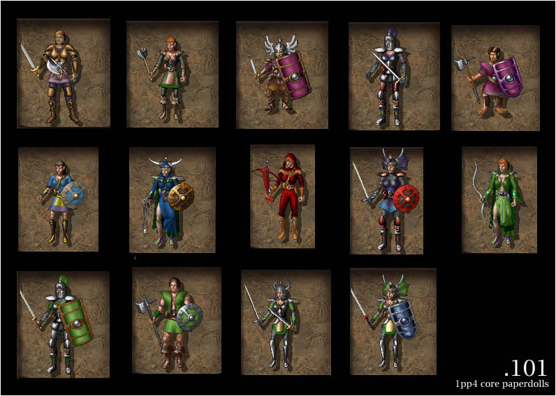 

The component that essentially started it all, this is a port of Baldur's Gate I style paperdolls for the Baldur's Gate II engine (used in SoA/ToB and HoW). Included are reworked 1ppv4 paperdolls for all race/class combinations matching vanilla animations as well as equipped object overlays. New in this version is detection and native support for Infinity Animations, including support for installs of HoW using BG1 animations via the <a href="http://www.shsforums.net/files/file/972-1pp-animation-fixes-for-iwd-totlm/">1pp IWD animation fixpack</a>.

###### <em>Note that this component does not update icon graphics or item colours, so it is not recommended to be installed by itself. It is, however, required for most of the components that follow.</em> 

<a href="#components">Back to components list</a>

------------------------

### [102-103] 1ppv4: Extended palette entries

<strong>Non-optional component</strong> 
Supports: SoA, ToB, Tutu, HoW, IWDII 

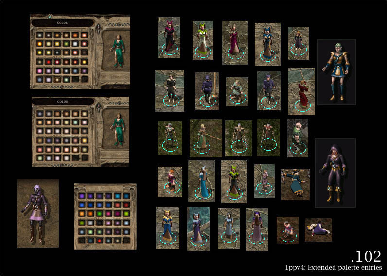

This component adds new colour gradients to Infinity Engine games, raising the count of available colours from 116 to 256. It also includes a new random colour table making use of them for Baldur's Gate II and new colour set files for Icewind Dale II, giving you more skin/hair colour choices for the various races. 
It also fixes a few minor problems with standard gradients. 
<a href="1pp/documentation//files/extpal_readme.html">Read more »</a>  

<strong>[102] Compatibility install</strong> 
For installs that do not support the binary patch (OSX), this installs the basic files needed for 1pp to work properly but does not support using the new colours as character colours.  

<strong>[103] Full install</strong> 
Complete install patching the game executable, enabling full use of the extended colour entries. 
When installing the full version, extra choices for skin and hair colour will automatically become available from the ingame selection. 
As for clothing colours, during character creation and from the inventory the standard complement of 34 primary and secondary colours will be offered. To access more clothing colours, choose 'customise' » 'colours' from the character sheet to gain access to yet another set of 34 colours. 

<a href="#components">Back to components list</a>

------------------------

### [104] 1ppv4: GUI additions for BGII

Supports: SoA, ToB, Tutu (if using the BG2 GUI) 

A reworked graphical user interface for Baldur's Gate II SoA/ToB. This aims to get rid of a lot of the rough edges present in the original while maintaining a similar feel. Major changes include a time dial that is not just a box, getting rid of 'infinite parchment' (see additional screenshots) and an optional choice of updated fonts. 
<a href="1pp/documentation/files/gui_readme.html">See more »</a> 

<a href="#components">Back to components list</a>

------------------------

### [105] 1ppv4: Avatar fixes

<strong>Requires: <a href="#101">[101]</a></strong> 
Supports: SoA, ToB, Tutu, HoW, IWDII 

This component contains fixes and improvements for several avatar series of Baldur's Gate II character animations, along with updated paperdolls to better match the new content. 
<a href="1pp/documentation/files/avafix_readme.html">See more »</a> 

<a href="#components">Back to components list</a>

------------------------

### [106-109] 1ppv4: Female Dwarves

<strong>Requires: <a href="#101">[101]</a></strong> 
Supports: SoA, ToB, Tutu, HoW, IWDII 

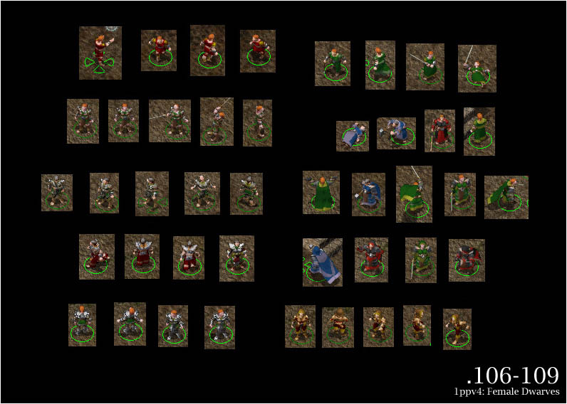

This component patches Baldur's Gate II engine games to use separate avatar animations for female dwarves and mages of small races, and includes game content for all of these. 
<a href="1pp/documentation/files/dwarf_readme.html">See more »</a> 

<a href="#components">Back to components list</a>

------------------------

### [110-112] 1ppv4: Thieves Galore

<strong>Requires: <a href="#101">[101]</a> <a href="#106">[106-109]</a></strong>
Supports: SoA, ToB, Tutu, HoW, IWDII 
###### Note: Due to the way patching is currently handled, this component will fail if Infinity Animations is already installed. To resolve this issue, install IA after this component.

In standard BGII only one armour level of thieves had unique animations (leather armour). Any other armour level would revert to the default unarmoured animation. On the inventory, the first two armour levels had unique paperdolls, anything else would revert to the unarmoured paperdoll. 
This component will patch your executable to support full thief animation sequences and install content for them. 
<a href="1pp/documentation/files/thieves_readme.html">Original readme »</a> 

<a href="#components">Back to components list</a>

------------------------

### [113] 1ppv4: Smart Avatar & Armour Switching

Supports: SoA, ToB, Tutu, HoW, IWDII 

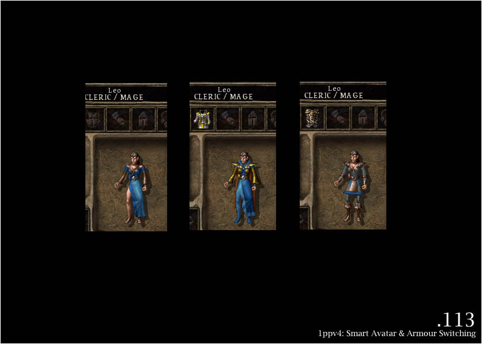

This component allows armour and robes to properly show up for characters of any class when equipped. While normally robes would not show up for fighter/cleric/thief animations, and armour would not show up for mage animations, this is circumvented by changing the character animation accordingly while such items are equipped. 
<a href="1pp/documentation/files/switch_readme.html">See original readme »</a> 

<a href="#components">Back to components list</a>

------------------------

### [114] 1ppv4: Softer Spell Effects

<strong>Requires enabled 3D support</strong> 
Supports: SoA (partial), ToB, Tutu, HoW, IWDII (placeholder) 

Substantially improved spell effects with smooth alpha blending for Baldur's Gate II engine based IE games. Note that 3D support has to be enabled for this component to work properly - if you run your game with software rendering mode, it is not recommended to install this. 
<a href="1pp/documentation/files/effects_readme.html">See more information »</a> 

<a href="#components">Back to components list</a>

------------------------

### [200] 1ppv4: Core content patches

<strong>Requires: <a href="#101">[101]</a></strong> 
Supports: SoA, ToB, Tutu 

This is essentially the inventory icon/item related patches of 1ppv2. In other words, lots of random icon improvements for BGII, especially on the ToB side of things, as well as some mod item patches and updates. It will form the basis on which 1ppv4 is built on SoA/ToB. 
<a href="1pp/documentation/files/v2_readme.html">See original readme »</a> 

<a href="#components">Back to components list</a>

------------------------

### [201] 1ppv4: Consistent spell and scroll icons

Supports: SoA, ToB, Tutu 

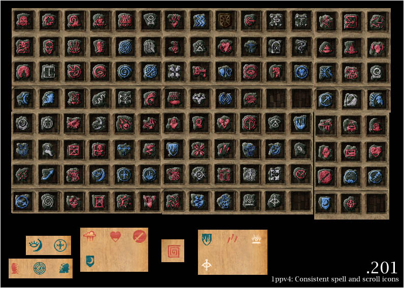

This component harmonises spell icons introduced in Baldur's Gate II with the ones in the original game. It updates icons found in the spellbook as well as the stone styled UI icons along with spell scrolls. 
<a href="1pp/documentation/files/spic_readme.html">See more »</a> 

<a href="#components">Back to components list</a>

------------------------

### [202] 1ppv4: Spell tweaks

Supports: SoA, ToB, Tutu 

Minor spell tweaks for SoA/ToB, giving armour spells distinct appearances (ghost armour, spirit armour) as well as reworked 'cause wounds' type of spells, bringing them into line with their p&amp;p equivalents and actually making them viable. 

<a href="#components">Back to components list</a>

------------------------

### [203] 1ppv4: Restored flame sword animations

<strong>Requires: <a href="#101">[101]</a></strong> 
Supports: SoA, ToB, Tutu, HoW, IWDII 

This component restores separate flame sword animations for Baldur's Gate II (similar to the ones in the original). It also includes flame short swords, adding a new item type to the game. 
<a href="1pp/documentation/files/fs_readme.html">See original readme »</a> 

<a href="#components">Back to components list</a>

------------------------

### [204] 1ppv4: Colourable Quarterstaves

<strong>Requires: <a href="#101">[101]</a></strong> 
Supports: SoA, ToB, Tutu, HoW, IWDII 

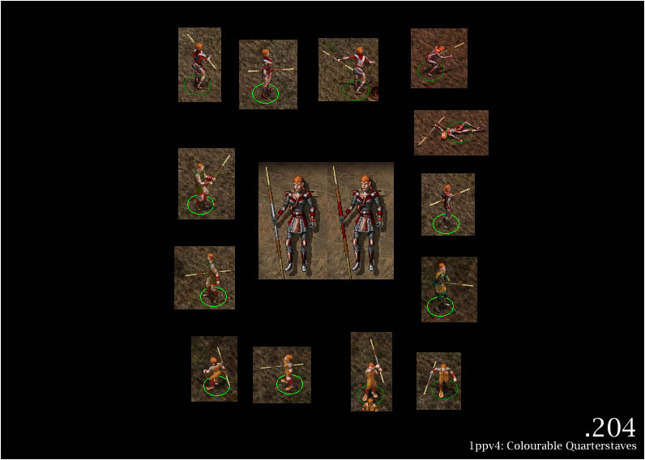

This component makes quarterstaves colourable by segment (as opposed to uniform) to allow more variety in-game and match inventory depictions. It also includes item patches to make use of the new content. 
<a href="1pp/documentation/files/qs_readme.html">See developer reference »</a> 

<a href="#components">Back to components list</a>

------------------------

### [205] 1ppv4: Legacy Shields v2

<strong>Requires: <a href="#101">[101]</a></strong> 
Supports: SoA, ToB, Tutu, HoW, IWDII 

Proper reconstruction and re-renders of the Baldur's Gate I shield animations, superseding the old legacy ports; thanks to invaluable support from the BG:EE team. 

<a href="#components">Back to components list</a>

------------------------

### [206] 1ppv4: Additional Shield Animations (core)

<strong>Requires: <a href="#101">[101]</a></strong> 
Supports: SoA, ToB, Tutu, HoW, IWDII 

This component includes updated versions of Baldur's Gate II's shield animations, as well as several completely new animation types. Also included is one variant that shares common animations but has distinct paperdolls. 

###### <em>Note that this is a core component; by itself it does not contain any item patches. If installed, the content will instead be used by following 1ppv4 components to give you more options when updating.</em> 

<a href="#components">Back to components list</a>

------------------------

### [207] 1ppv4: Wizards' Staves (core)

<strong>Requires: <a href="#101">[101]</a></strong> 
Supports: SoA, ToB, Tutu, HoW, IWDII 

This component includes one new animation (wizard's staff) as well as several new paperdoll appearances for regular colourable quarterstaves. 

###### <em>Note that this is a core component; by itself it does not contain any item patches. If installed, the content will instead be used by following 1ppv4 components to give you more options when updating.</em> 

<a href="#components">Back to components list</a>

------------------------

### [208] 1ppv4: Additional Helmet Animations (core)

<strong>Requires: <a href="#101">[101]</a></strong> 
Supports: SoA, ToB, Tutu, HoW, IWDII 

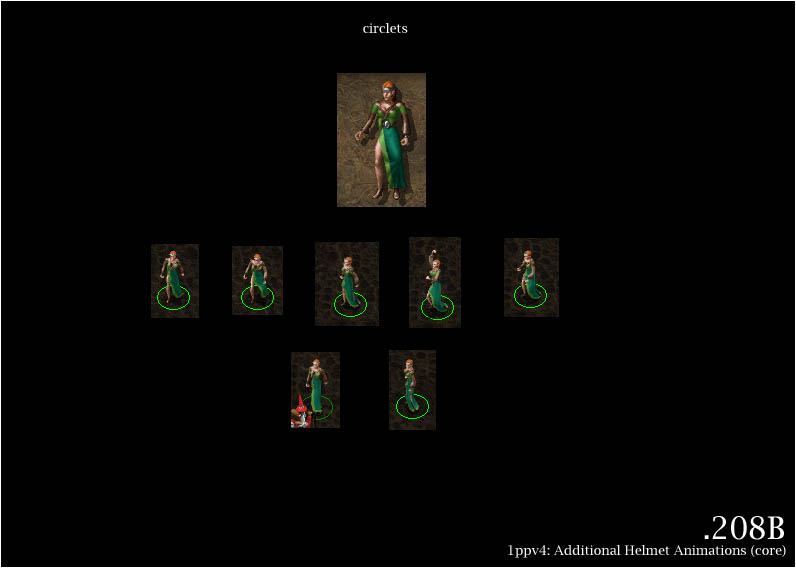

This component includes improved content for Baldur's Gate II's vanilla helmet animations, and introduces five new helmet animations (one not pictured). It also introduces circlets which actually render on model! 

###### <em>Note that this is a core component; by itself it does not contain any item patches. If installed, the content will instead be used by following 1ppv4 components to give you more options when updating.</em> 

<a href="#components">Back to components list</a>

------------------------

### [209] 1ppv4: Attachable wings (core)

<strong>Requires: <a href="#101">[101]</a></strong> 
Supports: SoA, ToB, Tutu, HoW, IWDII 

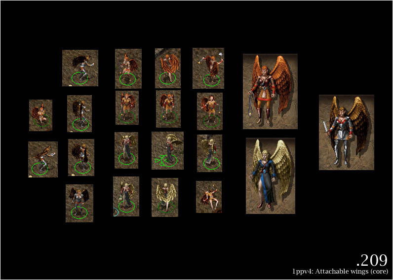

This adds equippable wings for elven characters (with some restrictions). 
<a href="files/wings_readme.html">See readme &amp; developer notes »</a> 

###### <em>Note that this is a core component; by itself it does not contain any item patches. If installed, the content will instead be used by following 1ppv4 components to give you more options when updating.</em> 

<a href="#components">Back to components list</a>

------------------------

### [210] 1ppv4: Increased paperdoll object variety (core)

<strong>Requires: <a href="#101">[101]</a></strong> 
Supports: SoA, ToB, Tutu, HoW, IWDII 

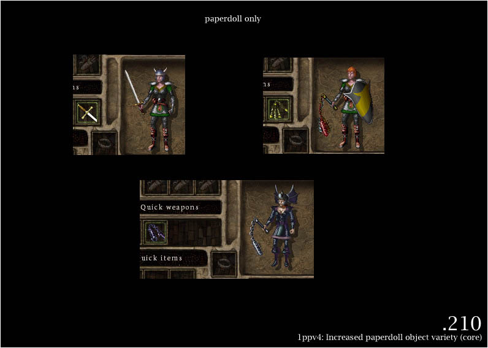

This component increases paperdoll variety by adding various alternates sharing existing object animations. Included are separate paperdoll appearances for bastard swords, various types of flails, maces, short bows, and more (not all of them pictured). 

###### <em>Note that this is a core component; by itself it does not contain any item patches. If installed, the content will instead be used by following 1ppv4 components to give you more options when updating.</em> 

<a href="#components">Back to components list</a>

------------------------

### [400] 1ppv4: Core updates and item patches

<strong>Requires: <a href="#101">[101]</a> <a href="#200">[200]</a> (on SoA/ToB/Tutu)</strong> 
<strong>Suggested: <a href="#203">[203]</a> <a href="#204">[204]</a> <a href="#205">[205]</a> <a href="#206">[206]</a> <a href="#207">[207]</a> <a href="#208">[208]</a> <a href="#209">[209]</a> <a href="#210">[210]</a></strong> 
Supports: SoA, ToB, Tutu, HoW 

This is the main 1ppv4 update component. Make sure you have all components you would like to see used installed before proceeding (suggested components will provide additional content and install choices). The following screenshots depict standard installation choices, except where noted otherwise. 

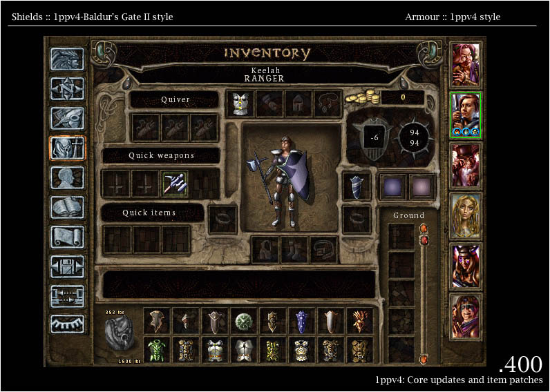

Before v4.2.0, various content choices were presented to you during installation (depending on which IE game you are installing for and installed components). 
As of version 4.2.0, installation options are moved into 1pp-config-default.ini file. If you want to modify them, please read this <a href="#config">chapter</a>.  
For a full, visual guide to choices see the link below. Consider choosing 'yes' to setting ITEM COLOURS FOR NON-MAGICAL ITEMS (setting 2/3). 
<a href="1pp/documentation/files/v4u_readme.html">Alternative install choices »</a> 

<a href="#components">Back to components list</a>

------------------------

### [401] 1ppv4: Improved projectile effects

<strong>Requires: <a href="#200">[200]</a> <a href="#400">[400]</a></strong> 
Supports: SoA, ToB, Tutu 

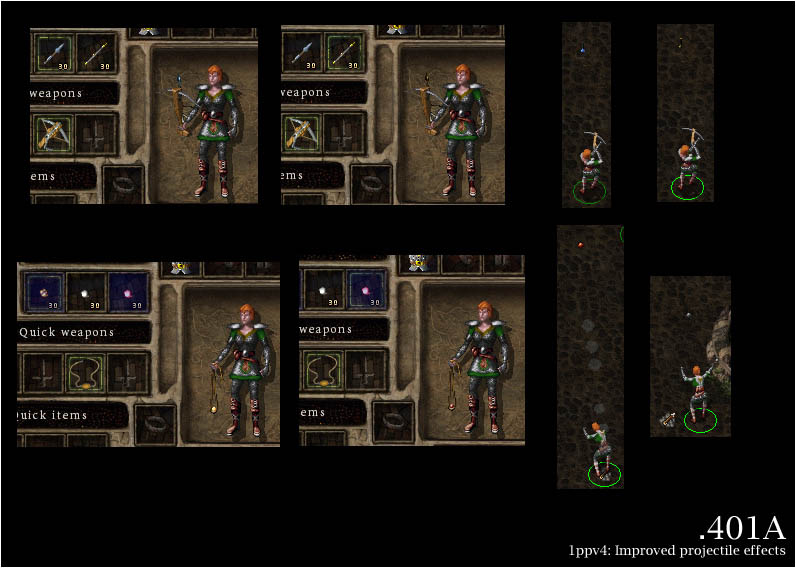

This component improves projectile effects around Baldur's Gate II. Be able to see what kind of bullets/arrows/bolts are shot at you (or if you're really absent-minded, which <em>you</em> are shooting). Includes coloured bolt and bullet projectiles, axes and darts, and what is even neater, you can actually see the ammunition change on your paperdoll! 

<a href="#components">Back to components list</a>

------------------------

### [300] 1ppv4: Fixed animations for solars and elementals

Supports: ToB, Tutu 

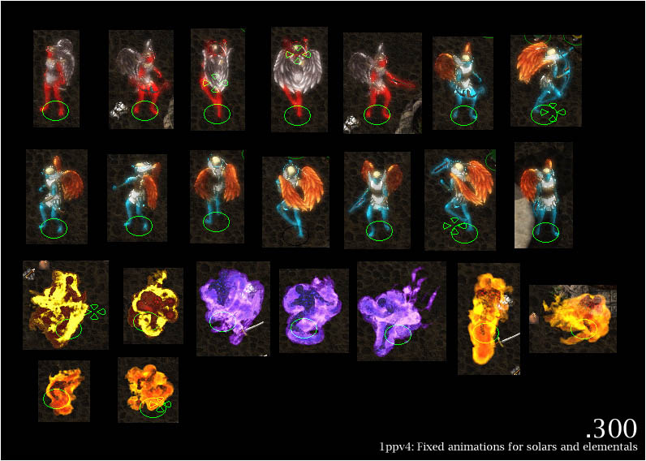

Fixed rendering for solar animations on ToB based games, as well as blended fire elementals. 

<a href="#components">Back to components list</a>

------------------------

### [301] 1ppv4: Miscellaneous content fixes

Supports: SoA, ToB, Tutu, HoW, IWDII 

Contains the following fixes: dog animations (corrupted palette), sitting static peasant woman (bad BAM conversion), alternate fire giant animation slot (was useless as the animation had no unified palette, thus impossible to fill). It also fixes an engine related bug on SoA/ToB and IWD:TotLM that will have helmets randomly render wrong sequences when changing equipment, making them 'float' off your character. Finally, it contains a fix for bugged shield z-buffering on SoA, ToB, IWD:TotLM and IWDII on BGII character animations. 

<a href="#components">Back to components list</a>

## Credits and Acknowledgements

For support or questions, please visit the <a href="http://www.shsforums.net/index.php?showforum=159">mod forum</a>.

#### Installer & content: <a href="http://www.shsforums.net/user/2954-erephine/">Erephine</a>

#### Tools used in creation (among others)

- <a href="http://www.weidu.org/%7Ethebigg/">WeiDU</a> by Wes Weimer, the bigg and Wisp.
- <a href="http://notepad-plus-plus.org/">Notepad++</a> by the Notepad++ team, Don Ho, and the spellcheck plug-in.
- <a href="http://www.shsforums.net/files/file/1048-weidu-highlighter-for-notepad/">WeiDU Notepad++ Highlighters </a> by Argent77.
- <a href="https://www.adobe.com/products/photoshop.html">Adobe Photoshop</a>.
- <a href="http://www.gimp.org/"><acronym title="GNU Image Manipulation Program">GIMP</acronym></a> by the GIMP team.
- <a href="http://www.gamani.com/">GIF Movie Gear</a>.
- <a href="https://www.autodesk.com/products/3ds-max/overview">3ds Max</a>.
- <a href="http://www.teambg.eu/?page=tools&amp;cat=32">BAM Workshop</a> by Glenn Flansburg.
- <a href="http://www.shsforums.net/topic/57564-bamworkshop/">BAMWorkshop 2</a> by Andrew Bridges.
- <a href="http://www.shsforums.net/files/file/552-developer-files-v2/">1pp dev tools</a> by Erephine.
- <a href="http://" target="_blank">Hex Editor Neo</a>.
- <a href="http://" target="_blank">ACDSee Pro</a>.
 

<a href="#top">Back to top</a>

## Version History

##### Version 4.2.0 (Month day, 2020)

<ins>a. General overhaul and re-looking</ins>
  - TODO Added *1pp.ini* metadata file to support AL|EN's "Project Infinity".
  - TODO Replaced `AUTHOR` keyword with `SUPPORT`.
  - TODO Added components `DESIGNATED` numbers and `LABELS`.
  - TODO Added "*always.tpa*" library.
  - Commented code as much as possible.
  - Replaced `GAME_IS` conditions with variables checks to speed up install time.
  - TODO Installation options have been moved into *1pp-config-default.ini* file. If you want to modify them, please read this <a href="#config">chapter</a>.
  - TODO Split huge [400] Core updates and item patches component into smaller ones for more comfortable readability and maintenance (checking 2500 or 3000 lines is easier when you search a glitch or a bug in more than 16000 lines of code!).
  - TODO Integrated all BWP Fixpack fixes (thanks Lollorian, The Imp and others!).
  - Added ToBEx compatibility.
  - TODO Provided partial <a href="https://www.gibberlings3.net/files/file/969-item-revisions/">Item Revisions</a>, <a href="https://www.gibberlings3.net/files/file/970-spell-revisions/">Spell Revisions</a> and <a href="https://www.gibberlings3.net/files/file/948-iwdification/">IWDification</a> compatibility in a rather soft way: As SR, IR and IWDification are still beta versions, I gave up trying to write a plain compatibility with them. It would be certainly obsolete in a few months, therefore a waste of time.
  - TODO Fixed typos and misspellings preventing a few items to be patched (or patching wrong ones...).
  - TODO Component Improved projectile effects [401] fully re-written: cleared duplicated vanilla #89 and #197 opcodes, cloned existing effects existants instead of adding new ones...
  - Coding simplification:
    - Replaced macros with functions whenever possible.
    - Copied entire folders instead of infinite lines of code (`COPY \~1pp/folder/file.ext\~ \~override\~` or `ACTION_FOR_EACH file IN list BEGIN COPY \~1pp/folder/file.ext\~ \~override\~ END`).
    - Grouped actions or patches with `ACTION_FOR_EACH` and `PATCH_FOR_EACH` whenever possible.
    - Used new and more efficient WeiDU functions (not released when Erephine wrote this mod) and Gwendolyne's patch functions to optimize the coding (e.g. `ADD_ITEM_EQEFFECT`, `ALTER_EFFECT` and `ALTER_ITEM_HEADER` replaced so many lines of codes!).
    - Avoided copying and overwriting the same files again and again...
  - Updated all readme files (1pp now supports translated readmes).
  - Added French translation (Gwendolyne).
  - Traification. Feel free to provide me with translations. I will include them as soon as possible.
  - TODO Removed unused files.
  - Reorganized folder architecture tree: created sub-folders to sort paperdolls .BAM files according to creature types. 
  - TODO Lower cased files.
  - Updated WeiDU installer to v246.
  - Uploaded mod to official Spellhold Studios GitHub mirror account.

<ins>b. Components specific changes and fixes</ins>
  - [101] 1ppv4: Core paperdolls - main component (101_base.tph, 101_ia.tph, 101_iwd.tph and 101_obj.tph)
    - Copied entire folders instead of infinite lines of code.
    - Infinity Animations paperdolls for Legacy animations (101_ia.tph): Replaced `READLN` action "*Use 1pp or IWD style female dwarf paperdolls?*" with reading new setting (1pp_fdwarf) from *1pp-config-default.ini* or *1pp-config-user.ini* [default value = 2 (1pp style)].
	- Reorganized folder architecture tree: created sub-folders to sort paperdolls .BAM files according to the creature types.

  - [102-103] 1ppv4: Extended palette entries (102_compat.tph and 103_extpal.tph)
    - Copied entire folders instead of infinite lines of code.

  - [104] 1ppv4: GUI additions for BGII (104_core.tph)
    - Copied entire folders instead of infinite lines.
    - Replaced `READLN` actions "*Do you want to include SoA style loading screens for ToB?*", "*Install updated fonts? (may cause issues with languages using different font .BAMs)*" and "*Use mixed case labels?*" with reading new settings (1pp_gui_soa, 1pp_updated_fonts and 1pp_mixed_labels) from *1pp-config-default.ini* or *1pp-config-user.ini*.

  - [105] 1ppv4: Avatar fixes (105_avatars.tph)
    - Copied entire folders instead of infinite lines of code.

  - [106-107-108-109] 1ppv4: Female Dwarves (106_f_dwarves_bg2.tph, 107_f_dwarves_iwd2.tph, 108_f_dwarves_odd2.tph and 109_f_dwarves_iwd.tph)
    - Copied entire folders instead of infinite lines of code.

  - [110-111-112] 1ppv4: Female Dwarves (110_thieves_iwd.tph, 111_thieves_bg2.tph and 112_thieves_iwd2.tph)
    - Copied entire folders instead of infinite lines of code.

  - [113] 1ppv4: Smart Avatar & Armour Switching (113_switch.tph)
    - Copied entire folders instead of infinite lines of code.
    - Used newer and more efficient `ADD_ITEM_EQEFFECT` WeiDU function to replace so many lines of codes.

  - [114] 1ppv4: Softer Spell Effects (114_effects.tph)
    - Replaced `READLN` action "*WARNING: This component will only work properly with 3D support enabled (alpha blending). Installing this component on BG2 in software rendering mode IS NOT A GOOD IDEA.*" with reading `3D Acceleration=1` in baldur.ini, icewind.ini or icewind2.ini before running the component.
    - Replaced `READLN` actions "*Install IWD-style Agannazar's Scorcher or alternate style?*", and "*Install less obtrusive dispel magic effect?*" with reading new settings (1pp_agannazar_scorcher and 1pp_dispel_magic_effect) from *1pp-config-default.ini* or *1pp-config-user.ini*.
    - Function `GW_MODIFY_PROJ` replaces <a href="https://github.com/BigWorldProject/Big-World-Fixpack/blob/16c96e60c38248266038639301b320af3b4318b7/Big%20World%20Fixpack/1pp/114_effects.tph.patch">Lollorian's BWP Fixpack misc patchified code changes</a> (modify new projectile values in ALL spell headers) which was inefficient and patched nothing. Moreover, it was using a wrong offset coding for ITM files. Source: <a href="https://github.com/BigWorldProject/Big-World-Fixpack/commit/1126bae51bf116fb82d8ad8d82882173cdb1a0d3">commit</a>.
    - Provided BG2 Fixpack and partial SR compatibility in a rather softer way.
    - specific fixes:
      - spin897.spl (Gas Spore): added BG2 Fixpack compatibility. BG2 Fixpack replaces CLOUDKIL.pro with cdnpcsym.pro, preventing 1pp to replace it with 1pgspore.pro.
      - spwi614.spl (Death fog): added Acid Fog SR compatibility. SR replaces CLOUDKIL.pro with dvafog.pro, preventing 1pp to replace it with 1pdeathf.pro.
      - spwi810.spl (Incendiary Cloud): added SR compatibility. SR replaces CLOUDKIL.pro with dvicloud.pro, preventing 1pp to replace it with 1pincind.pro.

  - [200] 1ppv4: Core content patches (200_1ppv2_cut.tph)
    - Added a new setting (1pp_hammers_icons) allowing to make alternate the overwriting of the Runehammer icon (saves vanilla ihamm10 icon and installs new ihamm10 1pp icon as ihamm05b), and not to set Borok's Fist's icon to Runehammers.
    - Replaced `READLN` action "*Do you want to include updated potion graphics?*" with reading new setting (1pp_potions_icons) from *1pp-config-default.ini* or *1pp-config-user.ini*.
    - Code simplified or re-written with newer functions to provide automatic process:
      - Replaced `WRITE_LONG 0x3E 0` and `WRITE_ASCII 0x3A \~ISHLDS01\~` with `WRITE_ASCII 0x3A \~ISHLDS01\~ #8`. Id. with offsets 0x48 0x44, and 0x5C 0x58.
      - Used `DELETE_EFFECT` and `CLONE_EFFECT` combo to add new equipped color effects, which avoids writing lines of codes!
    - 1ppv2 BAMs: saved a few vanilla inventory icons for modding purpose (Club of Detonation +3, Splint Mail +1, Chain Mail +3, Mage Robe of Cold Resistance, Mage Robe of Fire Resistance, Mage Robe of Electric Resistance, Knave's Robe, Traveler's Robe, Adventurer's Robe, Robes of the Good, Neutral, and Evil Archmagi, Suryris's Blade +2, Ravager +4, Halberd +3, The Eyes of Truth, Helm of the Rock, Leather Armor, Studded Leather Armor, Plate Mail, Mithral Field Plate +2, Quiver of Plenty +1, Bastard Sword +2, Celestial Fury +3, Short Sword of Mask +4, Angurvadal +4, Foebane +3, Purifier +4, Yamato +4, Usuno's Blade +4, Spectral Brand +4, Hindo's Doom +3, Bastard Sword +3, Katana +3, Scimitar +3, The Answerer +4, Gram the Sword of Grief +5). Instead of definitively overwriting them, it now saves them with V suffixe before overwriting them, and does not overwrite anymore the following icons that are irrelevant (EE does not validate this change) : does not replace iax1h14.bam (Axe of the Unyielding +3) with the very inaccurate IWD Celebrant's Blade icon, idagg11.bam (Boomerang Dagger) with a clone of imisc75 (Dagger of Venom), and isw1h06.bam (Varscona +2) with a clone of isw1h41 (Long Sword +2). Does not overwrite Harbinger's icon and copies an alternate resource for modding purpose (1isw2h07). This way, Harbinger keeps its golden icon which fits to its colors settings.
    - specific fixes:
      - dagg21.itm & dagg22.itm (Daggers of the Star): reverted to their original inventory icon idagg21. 1PP sets them to idagg18 (Shadow Thief Dagger icon), but EE does not validate this change.
      - halb07.itm (Halberd +2): reverted to its original inventory icon ihalb07. 1PP sets it to ihalb03 (Suryris's Blade +2 icon), but EE does not validate this change.
      - sw1h31.itm (Daystar +2): reverted to its original inventory icon isw1h31. 1PP sets it to isw1h34 (Albruin +1), but EE does not validate this change. Then switches back its colorisation with Albruin (400_update_bgii_swords).
      - sw1h34.itm (Albruin +1): reverted to its original inventory icon isw1h34. 1PP sets it to isw1h31 (Daystar +2), but EE does not validate this change. Then switched back its colorisation with Daystar (400_update_bgii_swords).
      - sw1h41.itm (Long Sword +2): reverted to its original inventory icon isw1h41. 1PP sets it to isw1h06 (Varscona +2 icon), but EE does not validate this change. Then removed the colorisation modified by 400_update_bgii_swords and sets it to sw1h73 (Long Sword +3) that deserves those settings.
      - sw2h10.itm and sw2h19.itm (Carsomyr +5 and +6): reverted to their original inventory icon isw2h10. 1PP sets them to isw2h20, but EE does not validate this change.
      - sw2h11.itm (Two-handed Sword +2): reverted to its original inventory icon isw2h11. 1PP sets it to isw2h03, but EE does not validate this change.
      - sw2h20.itm (Two-handed Sword +3): reverted to its original inventory icon isw2h20. 1PP sets it to isw2h06, but EE does not validate this change.
      - sw1hwk.itm (Water's Edge +3): fixed wrong identified name.
     - BW Herbs mod patches: fixed typo (was copying bw02ipo1_l.bam instead of bw02ipo1.bam).

  - [201] 1ppv4: Consistent spell and scroll icons (201_spellsandscrolls.tph)
    - Integrated BWP Fixpack patch: restored Energy Blades spell and scroll icons (SPWI920) overwritten with Black Blade of Disaster's ones.

  - [202] 1ppv4: Spell tweaks (202_spelltweaks.tph)
    - Integrated Lollorian's BWP Fixpack patch for individualised armor effects {<a href="https://github.com/BigWorldProject/Big-World-Fixpack/blob/16c96e60c38248266038639301b320af3b4318b7/Big%20World%20Fixpack/1pp/202_spelltweaks.tph.patch">202_spelltweaks.tph.patch</a>): modifies opcode #215 visual effect in ALL spell headers. Source: <a href="https://github.com/BigWorldProject/Big-World-Fixpack/commit/57211cf3a29cfd8381b62b3df13d3d04ed9f5fb2">commit</a>.

  - [208] 1ppv4: Additional Helmet Animations (208_v4_helmets.tph)
    - Integrated <a href="http://www.shsforums.net/topic/55047-1ppv410-release-download-discussion/page-12#entry561441">Lollorian's BWP Fixpack JC Helm animation crash fix for IA BG1 animation compatibility</a> (patch <a href="https://github.com/BigWorldProject/Big-World-Fixpack/blob/16c96e60c38248266038639301b320af3b4318b7/Big%20World%20Fixpack/1pp/208_v4_helmets.tph.patch">208_v4_helmets.tph.patch</a>): 1ppv4's helmet component seems to cause crashes when helmets using the JC animation are equipped by NPCs using BG1 animations from Infinity Animations. <a ref="http://www.shsforums.net/topic/55047-1ppv410-release-download-discussion/?p=561441">Source</a>

  - [210] 1ppv4: Increased paperdoll object variety (210_v4_ppd_variety.tph)
    - Simplified codes creating undroppable clones of weapons (notably with tutu_var) replacing primary weapon with undroppable clone and moving it to inventory.
    - CRE files: used `READ_LONG 0x28` instead of `READ_SHORT 0x28` (dword!).
    - ITM files: used `WRITE_LONG 0x18 (THIS BAND BNOT BIT2)` to remove droppable flag instead of writing the offset new value.

  - [300] 1ppv4: 1ppv4: Fixed animations for solars and elementals (300_solar_fix.tph)
    - Integrated <a href="http://www.shsforums.net/topic/58208-planetar-animation-glitch/">The Imp's BWP Fixpack fix for Solar swords without graphic artifacts</a>: fixed MASLG1S1.BAM and MSOLG2S1.BAM files. Source: <a href="https://github.com/omni-axa/BiG-World-Fixpack/commit/de7b3ce8439d8efa8e7427d1ad66efd0f48e547e">commit</a>.

  - [400] 1ppv4: Core updates and item patches (400_1pp_update_bgii.tph)
    - Split this huge component into smaller ones (checking 2500 or 3000 lines is easier when you search a glitch or a bug in more than 16000 lines of code!).
    - Added a new setting (1pp_hammers_icons) allowing to make alternate the overwriting of the Runehammer icon (saves vanilla IHAMM10 icon and installs new IHAMM10 1pp icon as IHAMM05B), and not to set Borok's Fist's icon to Runehammers.
    - Added a new setting (1pp_sleeper) allowing to make alternate the turning of The Sleeper into a flail. In any case, 1PP does not overwrites its original inventory bam with a new one, but installs a new icon (IBLUN16B) as an alternate, and saves the vanilla icon for compatibility with other mods purpose.
    - Replaced the tooltip section with two new functions that 1) add a fourth column if needed, 2) automatically writes values in tooltip.2da from the tra file.
    - Integrated <a href=http://www.shsforums.net/topic/56643-1pp-circlets-and-bg2tweaks-issue/?p=561849">Lollorian's BWP Fixpack patch for Ashes of Embers compatibility</a> (400_1pp_update_bgii.tph.patch): Renames 1PPv4 BAND0X.ITMs to XOBAND0X.ITMs, using Lollorian's prefix (according to BWL: XO, submitted by Chaplain, 11.03.2010, Prefix owner also known as Lollorian). <a href="https://github.com/BigWorldProject/Big-World-Fixpack/commit/1126bae51bf116fb82d8ad8d82882173cdb1a0d3">Source</a>.
    - Added ToBEx compatibility for circlets: item flag EE/Ex: Toggle critical hits flag (BIT25).
    - Gems sub-component: code simplified and re-written to avoid overwriting files when selecting option no lore needed for identification (1pp_gemlore = 2). Build an array to define new gems lore values to identify. .Same library used for IWD and BG2 based games.
    - Code simplified or re-written with newer functions to provide automatic process:
      - Replaced `WRITE_LONG 0x3E 0` and `WRITE_ASCII 0x3A \~ISHLDS01\~` with `WRITE_ASCII 0x3A \~ISHLDS01\~ #8`. Id. with offsets 0x48 0x44, and 0x5C 0x58.

    - shields specific fixes (400_update_bgii_shields.tpa):
      - shld02.itm (Small Shield +1): `LPM \~clear\~` was missing, and the code stacked op#7 global effects.
      - shld31a.itm (Gorm's Arm +3): fixed wrong coding (`WRITE_SHORT` instead of `WRITE_BYTE` for Minimum strength value).
      - shld01p.itm (Buckler +2): fixed wrong coding (op#0 parameter1 0xfffffe - 16777214 ?? - should be -3), added opcode #0 with parameter1 = -3 and parameter2 = 4 to add missing protection vs piercing weapons, added missing price, and fixed item description to fit ITM file.
      - x#ajshld.itm (Ilvastarr Family Shield - The BG1 NPC Project mod): fixed typo (was copying #ajshld instead of x#ajshld).
      - shld06p.itm (Redshield +1, +4 vs. monstrous): fixed wrong coding (op#219: switch parameter1 and 2, and parameter2 2 - EA.IDS - should be 3 - GENERAL.IDS), added an external effect (shld06P.eff), and replaced op#178 with op#177, otherwise opcode #178 won't work.
      - shld07p.itm (Sartessa's Vengeance +1): fixed wrong coding for add magical flag [replace `WRITE_BYTE 0x1b 0x6c` with `WRITE_LONG 0x18 (THIS | BIT6)`].
      - shld08p.itm (Tarloc's Contingency +1): code simplified (1tarsp.spl) and fixed wrong coding for Casting sound (1tarss.spl).
      - shld09p.itm (Shield of Devotion +1): fixed wrong coding op#62 (parameter2 should be 4, not 3).
    - helmets specific fixes (400_update_bgii_helmets.tpa):
      - helm33.itm (Gold Horned Helm): fixed typo (was copying helm22 instead of helm33).
      - xoband02.itm (Silver Circlet): fixed wrong coding opcodes #33, 34 & 35 (parameter2 originally set to 1 should be 0) and added opcodes #36 & 37 to match item description (+1 to saving throws).
      - xoband03.itm (Eilistraee's Boon +1): same fixes for opcodes #33, 34, 35, 36 & 37. Fixed wrong coding op#31: parameter1 originally set to 110, should be 10, and parameter2 switched from 2 to 0 to match item description (+10% magic damage resistance).
      - xoband04.itm (Circlet of the Archmagi): same fixes for opcodes #33, 34, 35, 36 & 37. Added one missing equipped effects (`LPM ADD_ITEM_EQEFFECT #19`).
    - weapons specific fixes (400_update_bgii_weapons.tpa):
      - dagg12.itm (Firetooth +3): fixed typos in `LPM \~pulse\~` macro (redundant setr variable set to 152 and 189 should be setg and setb, otherwise they overwrite the setr value and don't set the correct setg and setb values).
      - halb08.itm (Duskblade +2): fixed a typo patching halb06 instead of halb08.
      - hamm10.itm & hamm11.itm (Runehammers): new 1pp_hammers_icons setting gives the choice to assign them, or not, the Borok's Fist's icon.
    - miscellaneous specific fixes (400_update_bgii_misc.tpa):
      - misc89.itm (Edwin's Amulet): added bgmisc89 (BGT and IR compatibility).
      - book06.itm (Tome of Clear Thought), book07.itm (Tome of Leadership and Influence) and book08.itm (Tome of Understanding): harmonized header icon with new inventory icon (IBOOK768) for consistency.
    - swords specific fixes (400_update_bgii_swords.tpa):
      - Does not overwrite Varscona's icon with a clone of ISW1H41 (Long Sword +2) because EE does not validate this change.
      - sw1h31.itm (Daystar +2): as 1PP (Core content patches) sets its icon to isw1h34 (Albruin +1), but EE does not validate this change, this version reverts to its original inventory icon isw1h31, and this component switches back its colorisation with Albruin.
      - sw1h34.itm (Albruin +1): as 1PP (Core content patches) sets its icon to isw1h31 (Daystar +2), but EE does not validate this change, this version reverts to its original inventory icon isw1h31; and this component switches back colorisation with Daystar.
      - sw1h41.itm (Long Sword +2): as 1PP (Core content patches) sets its icon to SW1H06 (Varscona +2 icon), but EE does not validate this change, this version reverts to its original inventory icon isw1h41. Then, this component removes its re-colorisation and sets it to sw1h73 (Long Sword +3) that deserves those settings.
      - sw2h06.itm and sw1h13.itm (Spider's Bane +2): harmonized both versions. Now they get the same icon and coloration (no change from vanilla SW1H13 as its colors fit the new icon installed by 1PP).
      - sw2h07.itm (Harbinger +3): does not overwrite Harbinger's icon and copy an alternate resource for modding purpose. This way, Harbinger keeps its golden icon which fits to its colors settings.
      - SW1P01.itm (Viper's Edge +2): removed the #134 global effect (Petrification) otherwise it would be impossible to wield the sword. Fixed wrong coding (the extended effects were not implemented) and modified the cursed effects probabilities, so that they don't stack when not necessary (e.g. why should you be poisoned when petrified?).
    - blunt weapons specific fixes (400_update_bgii_blunt.tpa):
      - blun16.itm (The Sleeper +2): new 1pp_sleeper setting gives the choice to turn it into a flail. If turned into a flail, modifies minimum strength value and uses a new icon (IBLUN16B) to avoid overwriting the vanilla one (let's keep it for modders!).
    - armors specific fixes (400_update_bgii_armors.tpa):
      - chan03B.itm (Werebane Mail +2): added missing identified name.
      - plat15.itm (Pride of the Legion +2): reverted its inventory and description icons (wrongly set to iplat23 and cplat05) as EE does not validate this change.
      - plat23.itm (Full Plate Mail +2): removed from the patches as EE does not validate them (this silver and golden full plate was turned into a black one!).
    - new staves specific fixes (400_update_bgii_staves2.tpa):
      - Avoids copying and overwriting the same files again and again...
      - Macro `GW_ADJUST_TOOLTIP`: Adds new colums in tooltip.2da (makes sure it contains at least four columns, so we can add Narbucchad's Demise ability).
      - Function `GW_ADD_ITEM_TOOLTIPS`: Adds new entries in tooltip.2da.
    - scatters items specific fixes (400_update_bgii_scatter.tph):
      - Coding simplification:
        - Replaced combo `ADD_STORE_ITEM` + `REMOVE_STORE_ITEM` with `LPF REPLACE_STORE_ITEM`.
        - Replaced two `ADD_STORE_ITEM #1` with one `ADD_STORE_ITEM #2`.
      - dmark1.sto (Fovem, Docks merchant) & trmer02.sto (Trademeet merchant): set number_in_stock to 2, otherwise the former code did not work (was supposed to add one Plate and remove the Plate +1, but there was already 1 Plate in the store!

  - [401] 1ppv4: Improved projectile effects (401_projectiles.tph)
    - Code fully re-written with new functions to provide automatic process.
      - Function `GW_CLEAR_DUPLICATED_OPCODES`: does not stack anymore opcodes #83 and #197, clears duplicated vanilla #89 and #197 effects in SPL and ITM files and checks if protection from SPEAR and/or Bounce SPEAR is already set before adding it.
      - Function `GW_MODIFY_PROJ` replaces BWP Fixpack patch (<a href="https://github.com/BigWorldProject/Big-World-Fixpack/blob/16c96e60c38248266038639301b320af3b4318b7/Big%20World%20Fixpack/1pp/401_projectiles.tph.patch">401_projectiles.tph.patch</a>): modifies projectile value only when needed (does not patch melee headers anymore), replaces `ADD_ITEM_EQEFFECT`, `ADD_ITEM_EFFECT`, `ADD_SPELL_EFFECT` and macros with the newer and more efficient `CLONE_EFFECT` WeiDU function to give new opcodes #83 and #197 the same settings than existing ones (target, resist_dispel, duration, power...). It modifies all extended headers and avoids writing lines of codes!
      - Provided partial IR and SR compatibility in a rather soft way.
    - specific fixes:
      - ax1h08.itm (Hangard's Axe +2), ax1h09.itm (Rifthome Axe +3), ax1h10.itm (Azuredge +3) and ax1h16.itm (K'logarath +4): added IR compatibility (patches itemB files).
      - bolt09.itm (Bolt +3): fixed typo (was patching bolt06 instead of bolt09).
      - Sets new projectiles to Quivers of Plenty, Cases of Plenty, Bags of Plenty and Sling of Everard: Why quivers and launchers needing no ammo should not get new 1pp projectiles?
      - dagg11.itm (Boomerang Dagger +2) and dagg12.itm (Firetooth +3): added IR compatibility (patches itemB files).
      - sper04.itm (Javelin): switched Thrown and Melee strings ref in tooltip.2da.
      - items aurstaf, dragring, magebra, slayerwp and globblu4 (Blue Globe): added missing protections from new normal 1pp ammo projectiles (1dagg05 and 1dart01). The code was only providing protection from 1arow01 and 1bolt01 new projectiles.
      - npshld.itm (Delryn Family Shield): same fix as above + IR compatibility (protection from all types of missiles, including magic ones).
      - shld24.itm (Reflection Shield +1): same fix as above + cleared duplicate entries and adds IR compatibility (IR replaces opcode #197 with opcode #83).
      - brac18.itm (Gloves of Missile Snaring): Don't forget to add Protection from projectiles if IR is installed.
      - spin546.spl (Inertial Barrier), spcl721.spl (Storm Shield) & spcl914.spl (Greater Evasion): patched all headers (was patching only the first one), fixed wrong duration, target, power, resist dispel... Added missing protections from new normal 1pp ammo projectiles (1dagg05 and 1dart01). The code was only providing protection from 1arow01 and 1bolt01 new projectiles.
      - Protection From Normal Missiles spells (spra303, spwi311, & cdwi311 - added by BG2 Fixpack): same fixes as above & SR compatibility (protection from all types of missiles, including magic ones).
      - sppr613.spl (Physical Mirror): cleared duplicate entries and added SR compatibility (SR replaces opcode #197 with opcode #83).
      - Included Entropy Shield spell (protection from new 1pp projectiles) if IWDIfication is installed.

## 

##### Version 4.1.0 (November 3, 2012)

- Scale shields now have their own animations.
- Improved carried/description images.
- Fixed low resolution GUI overlap.

## 

##### Version 4.0.0 (August 6, 2012)

- Initial release.

<a href="#top">Back to top</a>

